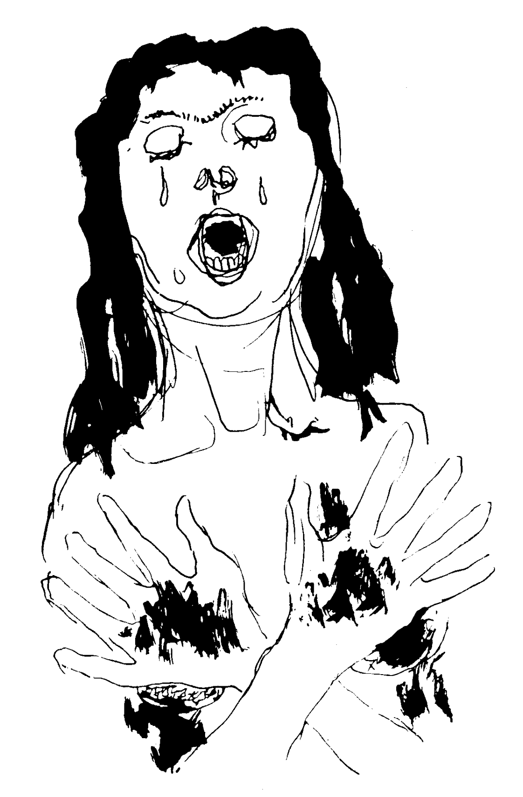

# 黒い悲しみのロマンセ

（提示来源：[rallizes.blogspot](http://rallizes.blogspot.com/2011/05/blog-post_8588.html)）

裸身集会的「黒い悲しみのロマンセ」这首歌歌名来自于洛尔迦（Federico Garcia Lorca）的吉普赛歌集（*Romancero gitano*，*Gypsy Ballads*）中的同名歌，英译为「Ballad of Deep Sorrow」，中译为「黑色痛苦谣」。日文、英文、中文译诗：

英译本*Gypsy Ballads*[下载](./images/lorcas-gypsy-ballads.pdf)；下图插画来自Robert H. Glauber；

## 黒い悲しみのロマンセ

> 雄鶏どものくちばしが
> 夜明けをもとめて地面を掘る
> そのころ暗い山から
> ソレダー・モントーヤが下りてくる
> 真鍮の彼女の肉体は
> 馬と影のにおいを放つ
> すすけた鉄床（かなしき）の胸が
> 無遠慮な歌をうなる
> ――ソレダー、つれもなしに、こんな時刻に
>
> お前は誰をたずねている？
> わたしが誰をたずねているとたずねたところで、
> ねえ、それがお前さんに何だというのさ？
> わたしは、探したいものを求めて来たのさ、
> わたしの喜びと私という人間を。
> ――おれの悲しみのソレダーよ、
> くつわを外された馬は
> やがては海を見つけだす。
> すると海の波に呑まれてしまうのだ。
> ――海のことを思い出させないでおくれ、
> オリーブの生える土地では
> オリーブの葉のさざめきの下で
> 黒い悲しみが湧き出すのだから。
> ――ソレダーよ、そなたは何という大きな悲しみを、
> 抱いているんだろう！
> お前の涙はレモンの汁、
> のぞみにも、口にもすっぱいレモンの汁。
> ――何と大きな悲しみだろう！
> まるで狂女のように家の中を、
> 二つのおさげを床にたらして
> 台所から寝室へわたしはかけまわる。
> ひどい悲しみ！ からだも衣服も
> わたしはまっ黒になって行く。
> 悲しや、わたしの木綿の肌着！
> 悲しや、わたしのひなげしの腿！
> ――ソレダーよ、ひばりの水で
> からだを清め、心も安らかに
> 待つがよい、ソレダー・モントーヤ。
>
> *
>
> はるか下の方で川が歌う
> 川は空と木の葉のすそ飾り。
> 新しい光は
> 南瓜の花の冠を戴く。
> おお、ジプシーたちの悲しみよ！
> 清らかな、いつも孤独の悲しみ。
> おお、隠れた河床と
> はるかな夜明けの悲しみよ！
>
> ——ジプシー歌集 / Federico Garcia Lorca著　東京 : 平凡社, 1969 (世界名詩集 ; 26)

## Ballad of Deep Sorrow

> The picks of the roosters
> dig looking for dawn
> as down the dark mountain
> comes Soledad Montoya.
> Yellow copper, her skin
> smells of horsed and of dusk.
> Smoky anvils are her breasts
> moaning round songs.
> ​	Soledad, whom are you seeking,
> ​	alone and so late?
> I'm seeking whom I seek!
> What's it to you?
> I come for what I'm looking for.
> me and my joy.
> ​	Soledad of my sorrows.
> ​	horse that takes its head,
> ​	you will end up in the sea
> ​	where the waves will swallow you.
> Don't speak to me of the sea——
> for black pain gushes
> through the land of the olives
> under the rustle of their leaves.
> ​	Soledad, what sorrows!
> ​	What awful sorrows!
> ​	You weep juice of lemons
> 	sour with waiting and whispers.
> Sorrow more than I can bear!
> Like a crazy woman
> I run through the house.
> My two braids sweep the floor
> from the kitchen to the bedroom.
> Deep in sorrow, turning jet-black
> from skin to clothes.
> Oh, my shirt of linen!
> Ah, my thighs of poppies!
> 	Soledad, wash your body
> 	in the broth of larks,
> 	and leave your heart in peace,
> 	Soledad Montoya.
>
> Below the river sings:
> ruttle of sky and leaves.
> With the flowers of the squash-vine
> the new light is crowned.
> Oh, sorrow of the gypsies!
> Sorrow clean and always lonely
> Sorrow of the hidden river
> and the far-off dawn.
>
> ——The Beloit Poetry Journal, Volume 2 - N0.1, Fall 1951, translated by Langston Hughes

## 黑色痛苦谣

> 当雄鸡用他们的尖喙
> 剥啄黑暗的破晓，
> 索莱达·蒙托娅
> 走下了蒙蒙亮的山坡，
> 她带着马和影子的气味，
> 皮肤是闪亮的黄铜。
> 她的双乳如同冒热气的铁砧
> 哼着那些循环的歌。
> “索莱达，你想找谁？
> 这么晚，这样孤独？”
> “我想找我要的那一个，
> 和你又有什么关系？
> 我来找我要找的，
> 我的欢乐，我自己的人。”
> “索莱达，我的小冤家，
> 你这匹脱缰的马
> 迟早会被冲进海里……”
> “别跟我说什么海
> 它的痛苦本来就扎根于
> 橄榄树的土地，
> 在这沙沙响的枝叶下。”
> “索莱达，你的命真苦！
> 你承受着怎样的悲伤啊！
> 你哭出的都是些酸柠檬汁，
> 看看你那苦涩的嘴！”
> “我能不苦吗！整日里
> 我替人家忙碌，发疯似地
> 从厨房到卧室
> 发辫都拖到地板上。
> 瞧瞧我这衣服和皮肤
> 我的罂粟花的大腿
> 都变得像煤球一样！”
> “索莱达，用云雀的清水
> 洗沐你的身子吧，
> 让你劳苦的心
> 得以休息，索莱达。”
>
> *
>
> 河流在下面歌唱：
> 天空和老树藤的花边。
> 初生的曙光给自己
> 戴上了几朵南瓜花。
> 啊，吉卜赛人的苦痛！
> 如此清晰，难以诉说。
> 它来自隐秘的河流
> 来自遥远的黎明。
>
> ——死于黎明 / Federico Garcia Lorca著，华东师大出版社，2016，译者王家新