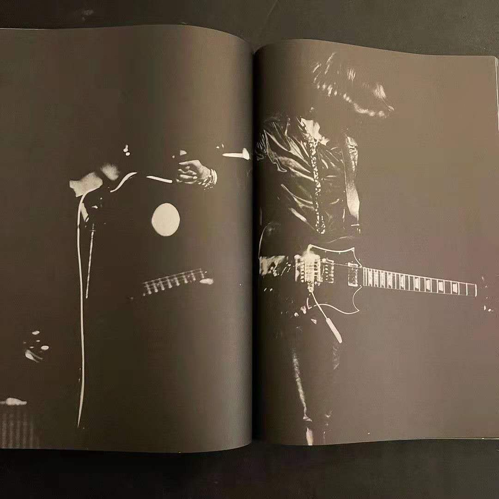
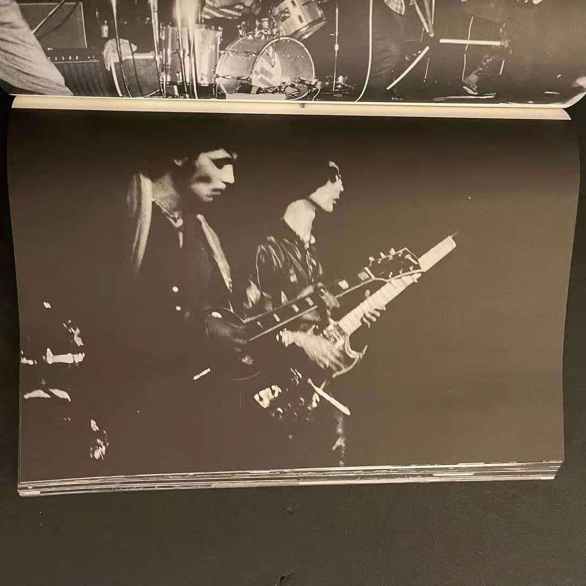
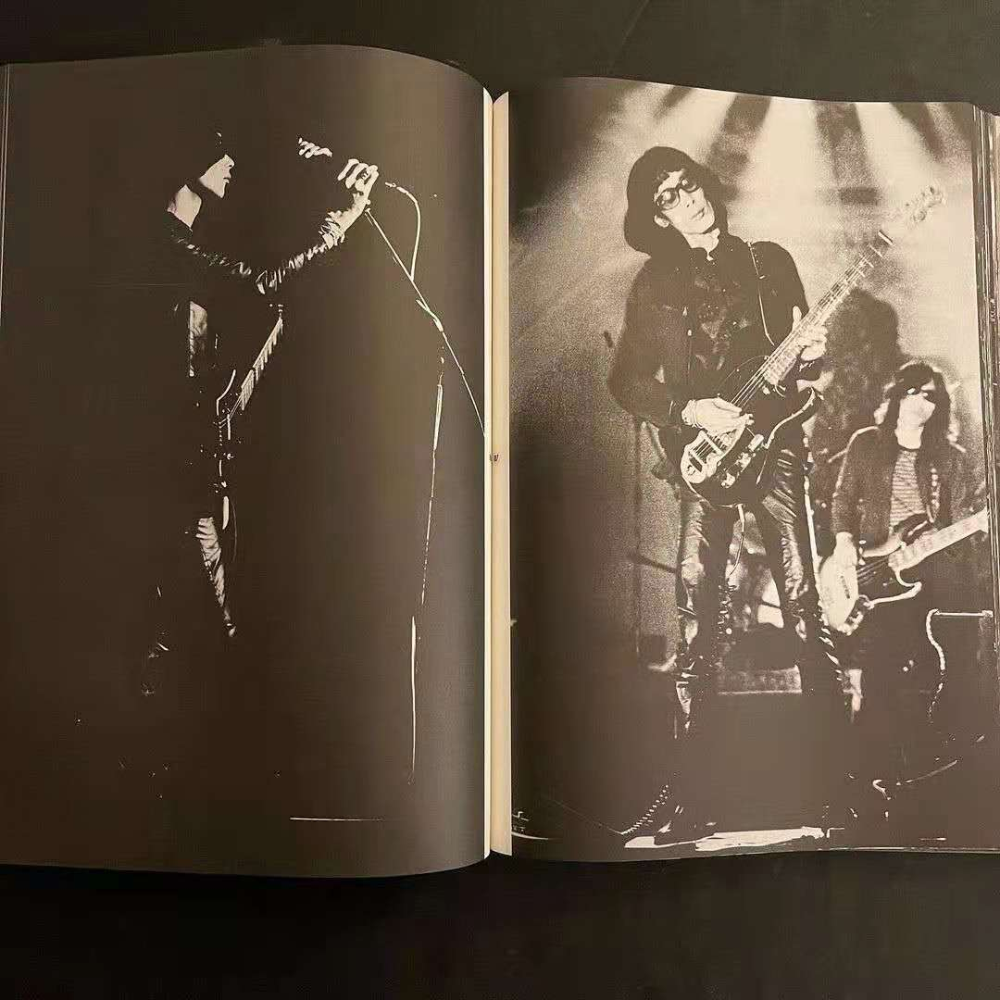

# Love

> “1946年，阿尔托再次说起了这场战斗：‘……并且我写作只是为了说出，我什么也没做过，什么也做不了，并且，当我在做什么的时候，我其实一无所做。我的全部作品就基于并且只能基于这虚无，这杀戮，这熄灭之火，水晶和屠宰的混战；一个人一无所做，一无所说，但一个人受难，一个人绝望，一个人战斗，是的，我相信一个人其实战斗。——一个人会欣赏战斗，评判战斗，为战斗辩护吗？不。它会被命名吗？也不。　　命名战斗，或许，就是杀死虚无。但首先是停止生命……一个人绝不会停止生命。’  
> ——引号里来自阿尔托1946年7月27日致彼得·沃森的信，参见Antonin Artaud，OEuvres complètes，tome ⅩⅡ，236. 全部摘录自布朗肖所写的《无尽的谈话》中的一篇*残酷的诗歌理性，飞行的强烈需求*

## 0
从昨天开始我又开始着手做这个网站，其实一共前前后后花了一共不到5个小时，总是觉得 要花很多时间去做，但是每次都是很快，现在这个网站可以真的自由生长起来了，因为我联系 到了一些朋友。我一直是很不擅长去主动联系朋友的，我知道大家其实都是温柔的，并且热情。

四三说：
> 那我想到一件趣事 我之前在家听他们一张CD的时候 我爸以为我音箱坏了跑过来问我 还有一次也是在听他们的CD的时候 突然和一个朋友打了一通电话 然后发现她的背景里面正好也在放他们的音乐 虽然不是同一首歌也很模糊 但是感觉特别的和谐跟亲切的感觉 当时就觉得很神奇 他们的音乐时间都很长 然后通话时间也变得很长 到最后甚至都没有说话 就只在听两个听筒里面的回声 谁都不想把自己的音乐关了

昨天[乌云茉莉](https://www.instagram.com/toycure/)还发来了一个杂志的Gin Satoh的摄影图片：

跟我组乐队失败，然后一起去学法语的wenc表示：

> 9月前，重新写点诗（关于裸集的），但有可能不是[以前那些](https://mp.weixin.qq.com/mp/profile_ext?action=home&__biz=MzU5NTM5NDk5MA==&scene=124#wechat_redirect)，总之重新写东西。

然后头像是[四人囃子猴子专辑](https://www.discogs.com/%E5%9B%9B%E4%BA%BA%E5%9B%83%E5%AD%90-Yoninbayashi-%E4%B8%80%E8%A7%A6%E5%8D%B3%E7%99%BA-Ishoku-Sokuhatsu/master/283315)的和小宇，还有现在说“其实我最喜欢的是[浅川maki](https://www.discogs.com/artist/658862-Maki-Asakawa)”的[Nene](https://ningkko.wordpress.com/)，还有被形容为“一朵开在中文互联网与社交非网络的奇葩，牛皮鲜告示牌”的BinchOuTan（地球），还有火化耳朵的张铎瀚，还有[硫酸饼干](https://matterofti.me/xu-xiang-zao-wu/)，写了小孔集的[弗然](https://mp.weixin.qq.com/s/XLw_fNLdpQQCzTdgnY4GsA)，还有总是热情的朋友们。还有最近开始做《*手册*》杂志，并且在2020年末开始全球征稿的[废船](https://mp.weixin.qq.com/s/XXin09DcPeuwWGtRztlAiA)，当然还有空之穴（hole in the sky），阿一和好几个秘密的网友，一起给朋友们翻译了大量优质内容，关于裸身集会的，也有 关于别的容易被忽视的日本乐队的内容。

当然还有最棒的[裸身集会脸书秘密小组](https://www.facebook.com/groups/2406438840)，Jim Ranhis称之为Les Rallizes Dénudés Facebook community，组成员还有[久保田麻琴](https://www.makotokubota.org/)，作为裸身集会大部分成员的朋友和曾经的成员，他在小组里也比较活跃。

## 1
另外有一些重要的文章，很多朋友应该都看过了，可以小总结一下：  

### 关于那篇Music Magazine的访谈

1. [Nene](https://ningkko.wordpress.com/)翻译了[中文版本](https://mp.weixin.qq.com/s/OKTOBSgpq2jHqBxEsx0-kQ)（发布在空之穴）
2. Jay Harris翻译了[英文的版本](http://legitvidya.com/archive/tl/mizu.html)（发布在他的博客的[LegitVidya Library](http://legitvidya.com/archive/archive.html)的Les Rallizes Denudes Series中）

### 那篇关于若林盛亮的访谈

1. Jay Harris翻译了英文的版本[Ex-Les Rallizes Dénudés Member and North Korean Defector](http://legitvidya.com/archive/tl/waka2.html)，
2. Dope Purple的[刘坚白](https://twitter.com/k_p_liu_)翻译了中文的版本[裸身集會組成50周年 劫機赴北韓的前成員娓娓道來](./docu/50.html)

---

## 再见，朋友

最后列出一些前辈：  
1. 一个已经消失的网站“lesrallizesdenudesexperience.web.fc2.com”，资料我已经放在了本站的[concerts](http://127.0.0.1:5501/content/kaos/concerts.html)一栏  
2. 收集了几乎全部图文资料的[rallizes.blogspot.jp](http://127.0.0.1:5501/content/kaos/rallizes.blogspot.jp)的ubud，大家都非常熟悉。在web.archive的时光机中可以看到ubud曾经的一个更加早期的网站 [裸のラリーズ：Unofficial](https://web.archive.org/web/20110524185227/http://www.yk.rim.or.jp/~ubud/rallizes.html)  
3. [高田清博](https://fuyusoubi.bandcamp.com/album/old-punks)（Kiyohiro Takada）(Doronco)  
4. [久保田麻琴](https://www.makotokubota.org/)（Makoto Kubota）  
5. 建立了[Japanoise](http://japanoise.net/)Web的[Maq Ito](https://www.facebook.com/maq.j.ito)
6. [Sundays&Cybele](https://sundayscybele.bandcamp.com/)的坪内和夫（Kazuo Tsubouchi）（他正[在視線X](https://www.youtube.com/channel/UCVHftSiFD0xkrXI8HsEiLpw)做裸身集会纪录片）

以上列出的几个前辈在存档上已经做到了极致，对于裸身集会来说，可能都不存在存档热这一说法，我们都知道，存档已走到了尽头。所以本站目前，到未来，将要做的或许是丢去个人生平历史的一种集体书写。情境主义国际的[Asger Jorn](https://en.wikipedia.org/wiki/Asger_Jorn)在他的文章*Diverted Painting*（*Peinture detournee*，May, 1959）中说“所有文化的元素，都必须reinvested，或者消失！”对于本站来说会是这样的。  

最后贴一首诗：
> 不变的事物 美妙的事物
> 未变 且 美妙的事物
> 比无常易逝中所见的美妙远为缜密严谨的事物
> 夜的领域 空间与维度 还有从那其中的逃逸
> 作为结果的逃逸 无意识的逃逸
> 当完成意识到的逃逸时
> 逃逸早就已经在预定的路上
> 消失殆尽了吧
> ——水谷诗，[想要知道更多的裸のラリーズ（水谷孝×汤浅学fax通信）](https://mp.weixin.qq.com/s/OKTOBSgpq2jHqBxEsx0-kQ)

我们永远不会听完，我们永远听不完，我们不想听完，我们也不能够听完，那个东西弥漫到了诗意空间的四处。

